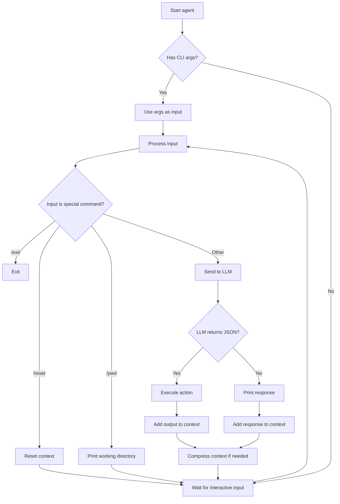

# Improvement Plan for agent.js

## Goals
1. Allow execution of any command (remove whitelist)
2. Maintain context with compression/cleaning when large
3. Work from the current working directory
4. Support command-line arguments as prompts

## Detailed Changes

### 1. Command Whitelist Removal
- Modify `runCommand` function to remove the `allowed` array.
- Keep safety via `AUTO_APPROVE` environment variable; if false, ask for confirmation.

### 2. Context Compression
- Install `gpt-tokenizer` for token counting.
- Define `MAX_TOKENS` (e.g., 6000) and `MAX_MESSAGES` (e.g., 20).
- After each assistant response, calculate total tokens of `messages`.
- If exceeds threshold, remove oldest user/assistant pairs (keeping system message).
- Optionally, implement summarization of removed messages (future enhancement).

### 3. Working Directory Awareness
- Include current working directory in system prompt.
- Add a `/pwd` command to show directory.
- Ensure file paths are resolved relative to `process.cwd()`.

### 4. Command‑Line Argument Support
- Parse `process.argv.slice(2)`.
- If arguments present, treat as initial user input.
- After processing, either exit or continue interactive mode based on `--interactive` flag.

### 5. Updated System Prompt
```
You are an autonomous coding agent that can execute any shell command, read/write files, and commit changes.

You are working in directory: <cwd>

When you need to perform an action, respond ONLY in JSON:

Run command: { "action": "run", "command": "..." }
Read file: { "action": "read", "file": "..." }
Apply patch: { "action": "patch", "file": "...", "content": "full new content" }
Commit: { "action": "commit", "message": "..." }

Otherwise respond normally.

Keep responses concise. The context window is limited; if the conversation grows too long, older messages will be compressed.
```

### 6. Token Counting Implementation
- Add `countTokens(text)` using `gpt-tokenizer`.
- Add `compressContext()` that trims messages.
- Integrate into the main loop.

## Workflow Diagram



## Next Steps
1. Implement each change in `agent.js`.
2. Test with various commands.
3. Verify context compression works.
4. Update documentation.

## Questions for User
- Are you satisfied with this plan?
- Do you prefer a different compression strategy (summarization vs truncation)?
- Should we add any additional features?